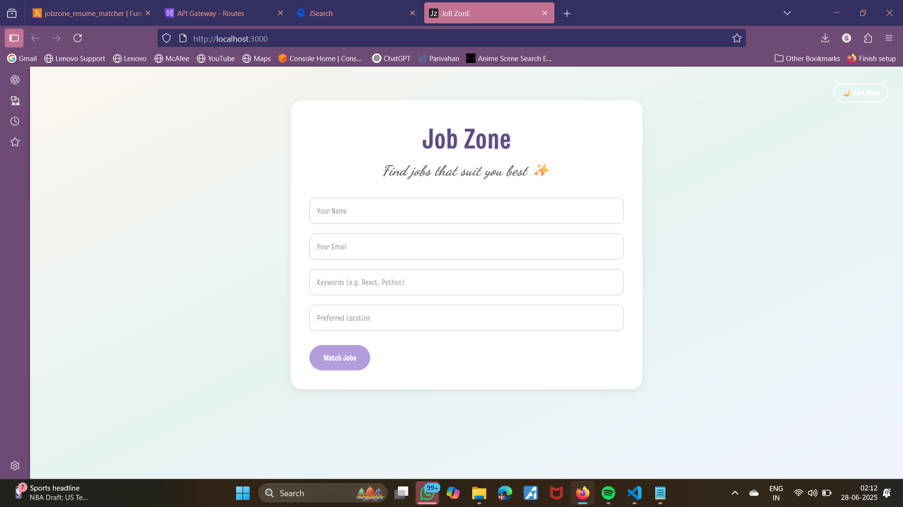
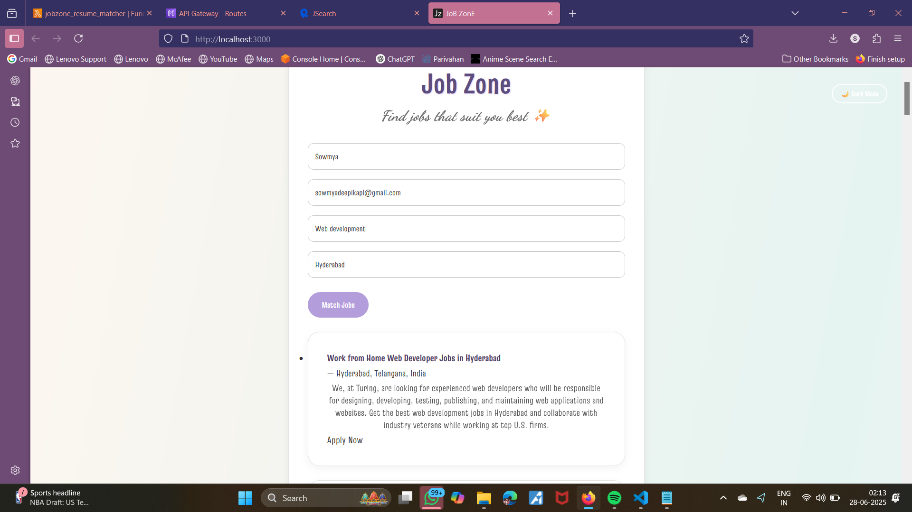
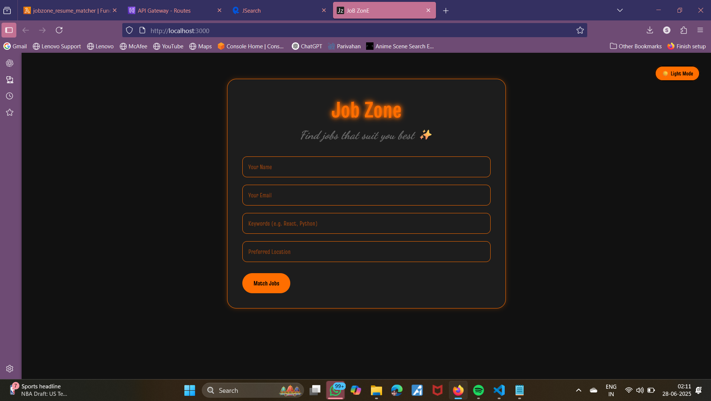

# 💼 JobZone

**A smart job matcher built using React frontend and AWS serverless backend.**

---

## 🚀 Overview

JobZone allows users to input their skills and preferred location, or upload a resume. It fetches relevant job listings using the JSearch API and displays them in a clean UI with light/dark mode support. It also stores user entries in DynamoDB for future tracking and insights.

---

## 🌐 Live Stack Overview

* **Frontend**: React.js

  * Neon-styled dark mode toggle
  * Form to input name, email, keywords, location
  * Job card layout
  * Responsive and animated UI

* **Backend**: AWS Lambda + API Gateway

  * REST API triggered by POST request
  * Parses user input and fetches jobs from JSearch API
  * Stores data into DynamoDB

* **Infrastructure**:

  * AWS Lambda (Python)
  * Amazon API Gateway
  * AWS DynamoDB
  * IAM Role for Lambda access
  * CORS enabled correctly

---

## 🖼️ Project Architecture (Docs)

```text
          +--------------------+
          |   React Frontend  |
          | (JobZone.jsx)     |
          +--------+----------+
                   |
                   | HTTP POST (user input)
                   v
          +--------+----------+
          |   API Gateway     |
          |   (CORS enabled)  |
          +--------+----------+
                   |
                   | Lambda Invocation
                   v
          +--------+----------+
          |   AWS Lambda       |
          | (lambda_function.py)
          +--------+----------+
                   |
        +----------+-----------+
        |                      |
        v                      v
 JSearch API         DynamoDB (Jobsearches)
 (Job Listings)      (User & job match data)
```

---

## 📂 Lambda Function Highlights

* Handles CORS preflight and POST requests
* Parses body: name, email, keywords, location
* Calls **JSearch API** with formatted query
* Stores matched jobs with user info into **DynamoDB**

## 🌈 Features

* 🎯 Instant job matching via API
* 🌙 Dark/Light mode toggle (with neon glow)
* 🧠 Resume parsing (coming soon)
* ☁️ AWS-native integration with serverless infra
* 🔒 Secure with environment variables and CORS

---
## 📸 Screenshots
> * Landing form
 ### 🌕 Light Mode

> * ### ✅ Job Results

> * ### 🌑 Dark Mode
  
---

## 🙌 Acknowledgements

* [RapidAPI JSearch](https://rapidapi.com/letscrape-6bRBa3QguO5/api/jsearch/)
* [AWS Free Tier](https://aws.amazon.com/free/)
* ReactJS & Vite
---
📄 Additional Documentation
All markdown files are located in /docs/ folder and help onboard contributors quickly:

[lambda-setup.md](lambda-setup.md)– How AWS Lambda was configured (runtime, env vars, IAM permissions)

[architecture.md](architecture.md)– System architecture diagram + overview

[api-gateway-config.md](api-gateway-config.md)– Route setup, integration, and CORS settings in API Gateway

[dynamodb-structure.md](dynamodb-structure.md)– Table name, primary keys, and example data structure
